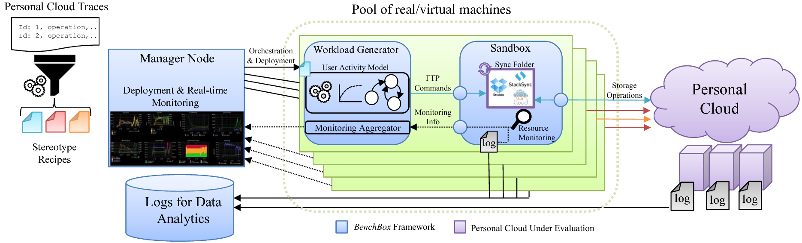
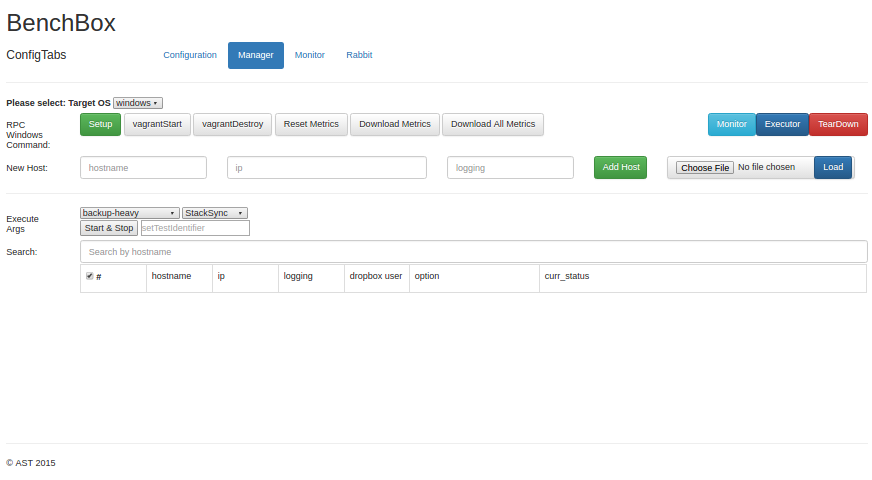
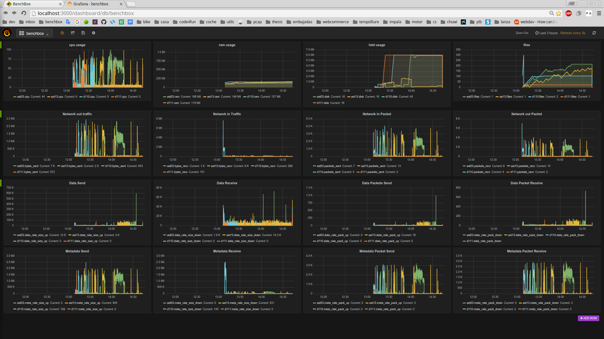

# BenchBox

**Table of Contents**

1. [Concept](#concept)
2. [Architecture](#architecture)
3. [Deployment Lifecycle](#deployment-lifecycle)
4. [Building Stereotype Recipe](#building-stereotype-recipe)
5. [Implementation](#implementation)
6. [Features](#features)
7. [Install](#install)
8. [Usage](#usage)
9. [Issue Tracking](#issues)
10. [Licensing](#licensing)
11. [Contact](#contact)

<a name="concept"></a>

# 1. Concept
BenchBox is a tool that adopts a user-centric performance evaluation methodology based on user stereotypes. An stereotype describes the behavior of a group of users with similar storage activity, which enables flexible and realistic performance evaluation of Personal Clouds. BenchBox enables researchers and practitioners to deploy benchmarks with varying rates of user stereotypes, as well as to monitor the desktop clients activity.

<p align="center">
  
</p>

<a name="architecture"></a>

# 2. Architecture
BenchBox is a distributed performance evaluation tool tailored to exercise Personal Clouds. BenchBox pays special attention to characterize and reproduce the behavior of users for generating realistic workloads. Next, we describe the architecture, operation and implementation of BenchBox. As visible in the figure, the architecture of BenchBox has three differentiated components. First, the entity that coordinates the benchmarking process is the manager node. The manager enables a practitioner to deploy an arbitrary number of BenchBox instances that will generate the workload itself, as well as to monitor the activity of these instances in real-time. Moreover, the manager node is able to configure BenchBox instances to emulate different types of user behavior, providing controlled flexibility to the workload generation process.

BenchBox instances are normally formed by pairs of workload generators and sandboxes that run on individual virtual machines. Workload generators are processes that integrate a user stereotype workload model. These processes should take as input a stereotype recipe file for generating storage load driven by a particular user behavior. By storage load, we refer to the synthetic files and folders created, as well as the operations performed on them. Workload generators translate the workload into FTP commands that are sent via a virtual interface to the sandbox virtual machine.

On the other hand, sandboxes are intended to run Personal Cloud desktop clients in an isolated environment for the sake of monitoring accuracy. That is, a set of monitoring tools capture the activity of a Personal Cloud desktop client (CPU load, disk, RAM memory, network...), in order to track its behavior and detect potential inefficiencies. All the network activity that desktop clients produce is monitorized in a primary virtual network interface, whereas a secondary one is used for sending storage commands from the workload generator.

Finally, the sandbox also resorts to the secondary virtual network interface to send monitoring information. In particular, the sandbox sends both real-time monitoring information to the manager node, as well as the experiment logs of each BenchBox instance to a data analytics repository for future analysis (e.g., Spark, Impala).

<a name="deployment-lifecycle"></a>

# 3. Deployment Lifecycle
Deploying performance analysis with BenchBox consists of the following phases: Configuration, deployment, warmup, execution, data collection, and tear-down. In the configuration phase, a practitioner defines at the manager node essential parameters for the experiment, such as the number of BenchBox instances to be deployed, the stereotype that each instance belongs to, or the experiment length, to name a few. Once these parameters have been set, the deployment phase distributes BenchBox instances across the available machines to execute the experiment. Naturally, a single configuration may be followed of multiple experiments to gain statistical confidence on the eventual results.

As soon as the virtual machines are deployed, BenchBox permits to execute a warm-up phase. The objective during this period is to generate a certain amount of storage load to exercise the Personal Cloud prior the actual workload generation (execution phase). For instance, during the warm-up phase BenchBox currently creates the directory structure of nodes, to further populate it with realistic contents.

During the execution phase, BenchBox instances generate the storage workload and monitor sandbox resources consumed by desktop clients. When the execution phase ends, the manager node orchestrates the BenchBox instances to store the collected logs into a data analytics repository, namely, data collection phase. Once the data collection phase ends, the manager node starts the tear-down phase that gracefully terminates the execution of BenchBox instances.

<a name="building-stereotype-recipe"></a>

# 4. Building Stereotype Recipes
User stereotype recipes are files that capture the necessary parameters of user behavior to feed a workload generator process. Therefore, if a designer aims at introducing a new user model in BenchBox, he or she should also consider the necessary metrics to be calculated of the different groups of users. Naturally, there is an interesting trade-off between the recipe complexity and the generation model’s accuracy.
One of the remarkable advantages of generating user stereotypes recipes from a system’s workload is that back-end traces remain private. That is, in BenchBox what practitioners share are the recipes that capture the behavior of users and the workload generation model, not the traces themselves. This new form of trace sharing may encourage today’s Personal Clouds to contribute user stereo type recipes from private traces for research purposes.

In this sense, our workload generation model needs from several input statistics to accurately emulate various aspects of users’ behavior. This makes stereotype recipes very compact and easy to share. For instance, none of the recipes built from the stereotypes proposed in 20KB in size. Thus, building stereotype recipes is a practical approach to share the behavior of users for benchmarking purposes, instead of exchanging large and potentially private back-end traces.

<a name="implementation"></a>

# 5. Implementation
BenchBox is mainly implemented in Python (XXX LoC). However, there are other parts of the framework that are written in other languages, such as the manager node Web interface (JavaScript, XXX LoC) or the automatic composition of virtual images for testing (Vagrant, XXX LoC). 

BenchBox can be easily adapted for evaluating multiple Personal Clouds thanks to the decoupled configuration of sandboxes. Specifically, practitioners define Vagrant a manifest file that is used to automatically build a virtual machine image with the necessary software to run a Personal Cloud client, as well as other required software during the experiment (e.g., monitoring tools). Currently, we provide
Vagrant manifests to evaluate StackSync and ownCloud, but we expect to add others in short.

We also adapted and integrated existing tools in BenchBox for specific aspects of the workload generation. For instance, the initial directory structure build during the warm-up phase is generated with Impressions. To generate realistic file contents, we resort to SDGen; a tool for generating data with similar compression properties (compressibility, compression times) compared to a target dataset.

BenchBox has been devised taking into account the different types of evaluations that are common in storage systems: in-house and large-scale. In early development stages, BenchBox can provide practical performance evaluation in owned resources (10’s to 100’s of VMs). For large scale experiments, BenchBox instances may be deployed in cloud providers, such as Amazon EC2 (100’s to 1000’s of VMs).

<a name="features"></a>

# 6. Features

* **Benchmarking tool for Personal Clouds** 
    * providers support:
        Dropbox
        StackSync
* **Experiments that simulate real user behaviour** [using user-stereotypes](https://github.com/cloudspaces/BenchBox/tree/master/workload_generator/user_stereotypes)
* **Same experiments workloads with differents providers** using pseudo random seeds
* **Easy to setup** one line installation.
* **Recreate filesystems that resembles real**, using Impressions and SDGen 
* **Experiment recipes are easyly shared**, they are contained within tinny files.

<a name="install"></a>

# 7. Install

BenchBox can be setup as follow, there are two roles, master or slave, the master deploy the manager server, while the slave are holding the experimentation instances of BenchBox:

To install BenchBox Clone clone the current repository to the machine that will be the master host and launch the manager service.
```
git clone https://github.com/cloudspaces/BenchBox.git;
cd BenchBox/manager;
vagrant up;
```

<a name="usage"></a>

# 8. Usage


1. Once the manager service is running open a browser to the manager interface:
<a href="localhost:8888">Manager interface</a>
By default the frontend will be launced at:
```
localhost:8888
```
2. The manager interface will look as follow:
<p align="center">
  
</p>
Once the frontend is available we can add BenchBox instances. After we have the testing instances succesfully binded, tested the connection using the ping. If the connection is established we can proceed to configure and deploy the BenchBox slave instances to each of the host. 
3. Launching experiments:
When the instances are succesfully deployed. We will be able to perform evaluations. During the evaluation the monitoring tab allows us to visualize realtime metrics of the benchBox instances, metrics like CPU usage, memory usage, disk usage, network usage that are currently supported...
<p align="center">
  
</p>


<a name="issue"></a>

# 9. Issue Tracking
We use the [GitHub issue tracking](https://github.com/cloudspaces/BenchBox/issues).
<br>
<pre>
Dependencies:
vagrant: 1.8.7
virtualbox: 4.3
openssh-server
</pre>


<a name="licensing"></a>

# 10. Licensing
Copyright (c) 2015 AST Research Group, Universitat Rovira i Virgili.

A research article with the results related to this software has been submitted for publication. 
Once the publication is accepted and the citation policy defined, this software will be under GPLv3 license.

<a name="contact"></a>

# 11. Contact
Visit http://ast-deim.urv.cat or http://cloudspaces.eu for contact information.

